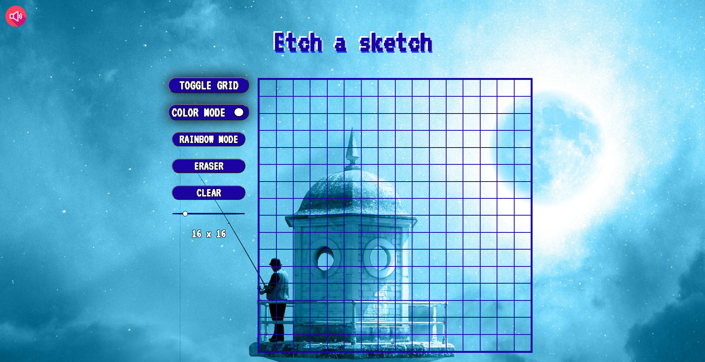
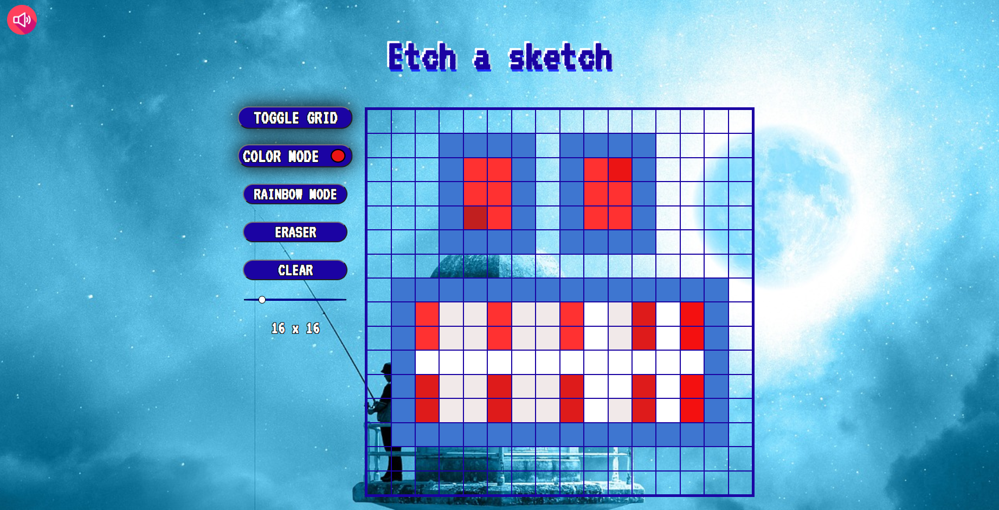
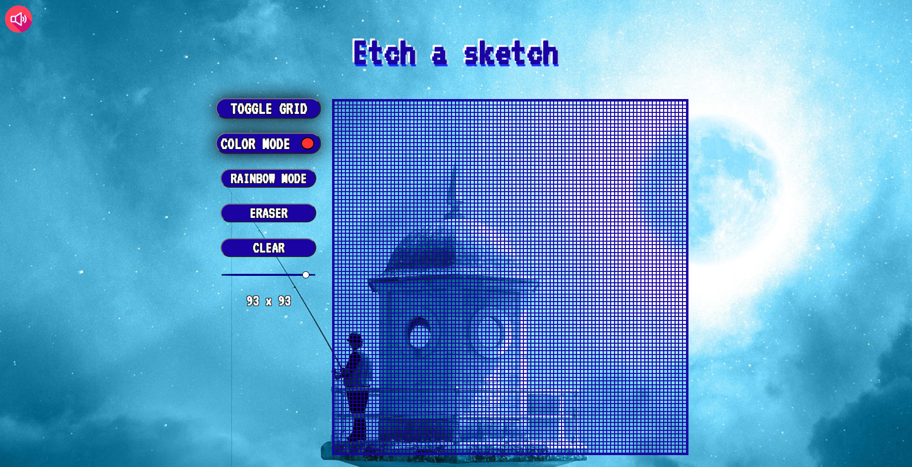

## Etch a Sketch

Etch a Sketch is a web drawing app created by me using Javascript, CSS and HTML.

## Features

- [x] Canvas where user can draw
- [x] "Toggle Grid" Button for user to toggle the grid lines allowing percise drawing.
- [x] "Color Mode" Button for user to use and change color to their liking.
- [x] "Rainbow Mode" Button for user to draw using random colors.
- [x] "Eraser" Button for user to erase unwanted coloring.
- [x] "Clear" Button for user to clear/empty their current drawing.
- [x] "Grid size" slider for user to choose the grid size of their liking.
- [x] Background music and button pressing sound effects (Mute button found on top left).
- [x] Compatible with laptop and desktop screens (will be adapting to smartphones soon).

## Deployment

Available live at: https://charbytesdev.github.io/etch-a-sketch

A web drawing app created with vanilla Javascript and styled using CSS.

 

 
 

## Built With

- [HTML](https://developer.mozilla.org/en-US/docs/Web/HTML) - Hyper Text Markup Language
- [CSS](https://developer.mozilla.org/en-US/docs/Web/CSS) - Cascading Style Sheets
- [JS](https://developer.mozilla.org/en-US/docs/Web/JavaScript) - Programming Language
